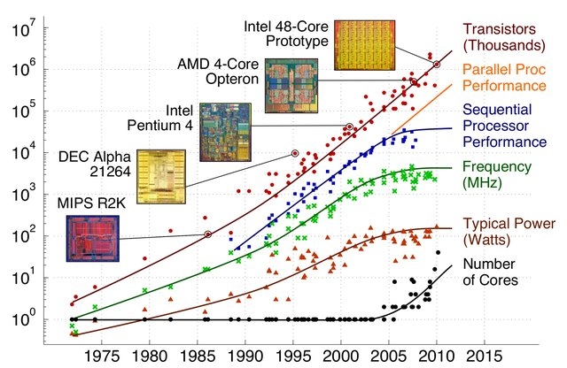
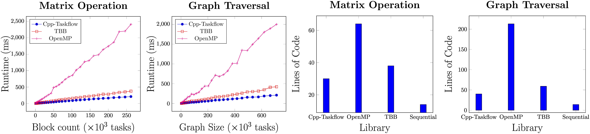
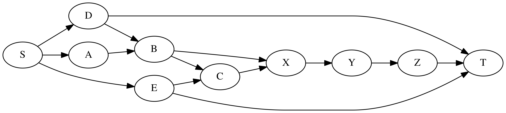
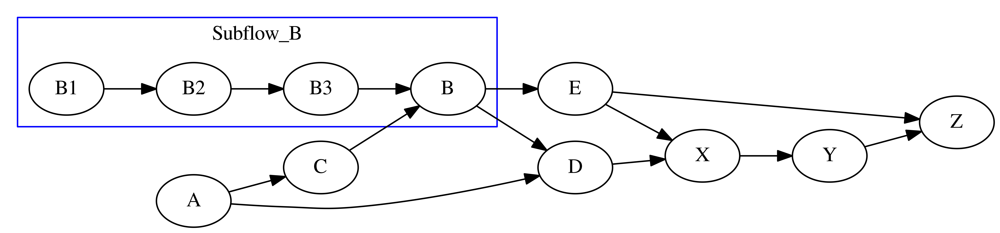

+++
# Project title.
title = "Cpp-Taskflow"

# weight to appear
weight = 1

# Date this page was created.
date = 2019-03-01

# Project summary to display on homepage.
summary = "A modern C++ task-based parallel programming library."

# Tags: can be used for filtering projects.
# Example: `tags = ["machine-learning", "deep-learning"]`
tags = ["parallel-programming", "multi-threading", "programming-model", "task-parallelism"]

# Optional external URL for project (replaces project detail page).
#external_link = "https://github.com/cpp-taskflow/cpp-taskflow"

# Featured image
# To use, add an image named `featured.jpg/png` to your project's folder. 
[image]
  # Caption (optional)
  #caption = "Photo by Toa Heftiba on Unsplash"

  # Focal point (optional)
  # Options: Smart, Center, TopLeft, Top, TopRight, Left, Right, BottomLeft, Bottom, BottomRight
  focal_point = "Smart"
+++

A fast C++ *header-only* library to help you quickly write parallel programs with complex task dependencies

# The Era of Parallel Computing

The evolution of computer architectures is moving toward multicore designs.
It is common to find multiprocessor systems in today's electronic products
such as mobiles, laptops, desktops, and servers. 
In order to keep up with the performance scaling, it is becoming necessary for software developers to write parallel programs that utilize the number of available cores.

This Cpp-Taskflow project addresses a long-standing questions, 
"*How can we make it easier for developers to write efficient parallel programs 
under complex task dependencies?*"

# A New Parallel Tasking Library

Cpp-Taskflow is by far faster, more expressive, fewer lines of code, and easier for drop-in integration
than existing parallel task programming libraries such as [OpenMP Tasking][OpenMP Tasking] and Intel [TBB FlowGraph][TBB FlowGraph].

Cpp-Taskflow enables you to implement efficient task decomposition strategies
that incorporate both regular loop-based parallelism 
and irregular compute patterns to optimize multicore performance.

| Without Cpp-Taskflow | With Cpp-Taskflow |
| :------------------: | :---------------: |
|  |  |

Cpp-Taskflow has a unified interface for both *static* tasking and *dynamic* tasking,
allowing users to quickly master our parallel task programming model in a natural idiom.

| Static Tasking | Dynamic Tasking |
| :------------: | :-------------: |
|  |  |

Cpp-Taskflow is committed to support both academic and industry research projects,
making it reliable and cost-effective for long-term and large-scale developments.

# Get Involved

See a quick [presentation][Presentation] and 
visit the [project GitHub][Cpp-Taskflow GitHub] and [documentation][wiki] to learn more about Cpp-Taskflow.

* * *

[OpenMP Tasking]:        http://www.nersc.gov/users/software/programming-models/openmp/openmp-tasking/
[TBB FlowGraph]:         https://www.threadingbuildingblocks.org/tutorial-intel-tbb-flow-graph
[Cpp-Taskflow GitHub]:   https://github.com/coo-taskflow/cpp-taskflow/
[wiki]:                  https://cpp-taskflow.github.io/cpp-taskflow/index.html
[Presentation]:          https://cpp-taskflow.github.io/

