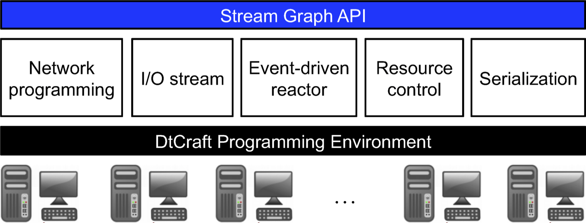
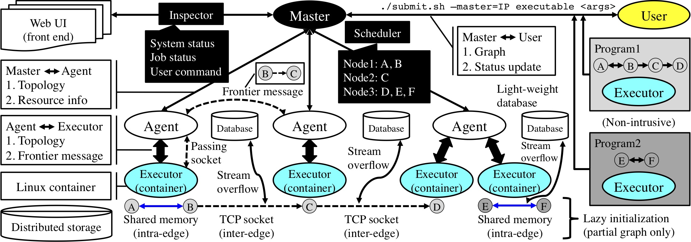

+++
# Project title.
title = "DtCraft"

# weight to appear
weight = 2

# Date this page was created.
date = 2019-03-01

# Project summary to display on homepage.
summary = "A general-purpose distributed programming system."

# Tags: can be used for filtering projects.
# Example: `tags = ["machine-learning", "deep-learning"]`
tags = ["parallel-programming", "distributed-system", "programming-model", "big-data"]

# Optional external URL for project (replaces project detail page).
#external_link = "https://github.com/cpp-taskflow/cpp-taskflow"

# Featured image
# To use, add an image named `featured.jpg/png` to your project's folder. 
[image]
  # Caption (optional)
  #caption = "Photo by Toa Heftiba on Unsplash"

  # Focal point (optional)
  # Options: Smart, Center, TopLeft, Top, TopRight, Left, Right, BottomLeft, Bottom, BottomRight
  focal_point = "Smart"
+++

A general-purpose distributed programming system using data-parallel streams.

# New Distributed Programming Model

DtCraft offers a new powerful programming model called stream graph to 
streamline the creation of distributed workloads. 
Users can focus on high-level developments using our models, 
leaving difficult concurrency details such as workload distribution and
process communication to our system kernel.



There are myriads of cluster computing frameworks such as Hadoop MapReduce, Apache Spark, Dryad, and Ray. Each has its reason to exist. In DtCraft, we target at:

- **Programming model**. DtCraft leverages modern C++17 to offer a new general-purpose distributed programming model. 

- **Performance**. DtCraft is designed completely from the ground up using advanced software techniques to deliver the best performance.

- **Productivity**. DtCraft allows you to easily bring up a distributed workload in just a few lines of code. 

The figure below gives an overview of the system architecture of DtCraft.




# Distributed "Hello-World"

The code snippet below demonstrates an example of using 
DtCraft's programming model to create a distributed "hello-world" program.

```cpp
#include <dtc/dtc.hpp>

using namespace std::literals;  // for the use of string literal
using namespace dtc::literals;  // for the use of memory literal

int main(int argc, char* argv[]) {

  dtc::Graph G;

  auto A = G.vertex();
  auto B = G.vertex();

  auto lambda = [] (dtc::Vertex& v, dtc::InputStream& is) {
    if(std::string s; is(s) != -1) {
      std::cout << "Received: " << s << '\n';
      return dtc::Event::REMOVE;
    }
    return dtc::Event::DEFAULT;
  };

  auto AB = G.stream(A, B).on(lambda);
  auto BA = G.stream(B, A).on(lambda);

  A.on([&AB] (dtc::Vertex& v) { (*v.ostream(AB))("hello world from A"s); });
  B.on([&BA] (dtc::Vertex& v) { (*v.ostream(BA))("hello world from B"s); });

  G.container().add(A).cpu(1).memory(1_GB);
  G.container().add(B).cpu(1).memory(1_GB);

  dtc::Executor(G).run();

  return 0;
}
```

# Get Involved

Please visit our [DtCraft GitHub][DtCraft GitHub] for more details.

* * *

[DtCraft GitHub]:   https://github.com/twhuang-uiuc/DtCraft


