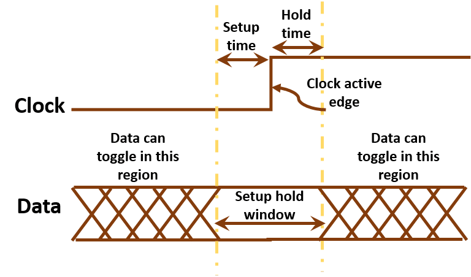

+++
# Project title.
title = "OpenTimer"

# weight to appear
weight = 3 

# Date this page was created.
date = 2019-03-01

# Project summary to display on homepage.
summary = "A high-performance timing analysis tool for VLSI systems."

# Tags: can be used for filtering projects.
# Example: `tags = ["machine-learning", "deep-learning"]`
tags = ["static-timing-analysis"]

# Optional external URL for project (replaces project detail page).
#external_link = "https://github.com/cpp-taskflow/cpp-taskflow"

# Featured image
# To use, add an image named `featured.jpg/png` to your project's folder. 
[image]
  # Caption (optional)
  #caption = "Photo by Toa Heftiba on Unsplash"

  # Focal point (optional)
  # Options: Smart, Center, TopLeft, Top, TopRight, Left, Right, BottomLeft, Bottom, BottomRight
  focal_point = "Smart"
+++

A High-Performance Static Timing Analysis Tool for VLSI Systems

# Static Timing Analysis

Static timing analysis (STA) is an important step in the over chip design flow.
It verifies the expected timing characteristics of a circuit and ensures
the chip can provide correct function after tape-out.



A practical timer has to interact with other tools that often
call the timer thousand times in an inner loop.
This raises many computational challenges, such as
incremental timing,
parallelization,
scalability, and pessimism reduction.

# What is OpenTimer?

OpenTimer is a new STA tool to help IC designers quickly verify the circuit timing.
It is developed completely from the ground up using modern C++
to efficiently support parallel and incremental timing. 
Key features include:

+ Industry standard format (.lib, .v, .spef, .sdc) support
+ Graph- and path-based timing analysis
+ Parallel incremental timing for fast timing closure
+ Award-winning tools and golden timers in CAD Contests

OpenTimer lets you quickly analyze the timing critical paths of a design
so you can have reasonable turnaround time and performance.

```
ot> report_timing
Startpoint    : inp1
Endpoint      : f1:D
Analysis type : min
------------------------------------------------------
       Type       Delay        Time   Dir  Description
------------------------------------------------------
       port       0.000       0.000  fall  inp1
        pin       0.000       0.000  fall  u1:A (NAND2X1)
        pin       2.786       2.786  rise  u1:Y (NAND2X1)
        pin       0.000       2.786  rise  u4:A (NOR2X1)
        pin       0.181       2.967  fall  u4:Y (NOR2X1)
        pin       0.000       2.967  fall  f1:D (DFFNEGX1)
    arrival                   2.967        data arrival time

related pin      25.000      25.000  fall  f1:CLK (DFFNEGX1)
 constraint       1.518      26.518        library hold_falling
   required                  26.518        data required time
------------------------------------------------------
      slack                 -23.551        VIOLATED
```

We introduced a new *API concept* to facilitate the parallelization 
of incremental timing. 
You can use our C++ API to integrate OpenTimer to your project.

```cpp
#include <ot/timer/timer.hpp>                     // top-level header to include

int main(int argc, char *argv[]) {

  ot::Timer timer;                                // create a timer instance (thread-safe)

  timer.read_celllib("simple.lib", std::nullopt)  // read the library (O(1) builder)
       .read_verilog("simple.v")                  // read the verilog netlist (O(1) builder)
       .read_spef("simple.spef")                  // read the parasitics (O(1) builder)
       .read_sdc("simple.sdc")                    // read the design constraints (O(1) builder)
       .update_timing();                          // update timing (O(1) builder)

  if(auto tns = timer.report_tns(); tns) std::cout << "TNS: " << *tns << '\n';  // (O(N) action)
  if(auto wns = timer.report_wns(); wns) std::cout << "WNS: " << *wns << '\n';  // (O(N) action)

  timer.dump_timer(std::cout);                    // dump the timer details (O(1) accessor)

  return 0;
}
```

# Get Involved

Please visit our [OpenTimer GitHub][OpenTimer GitHub] to learn more details.

* * *
[OpenTimer GitHub]:      https://github.com/OpenTimer/OpenTimer


