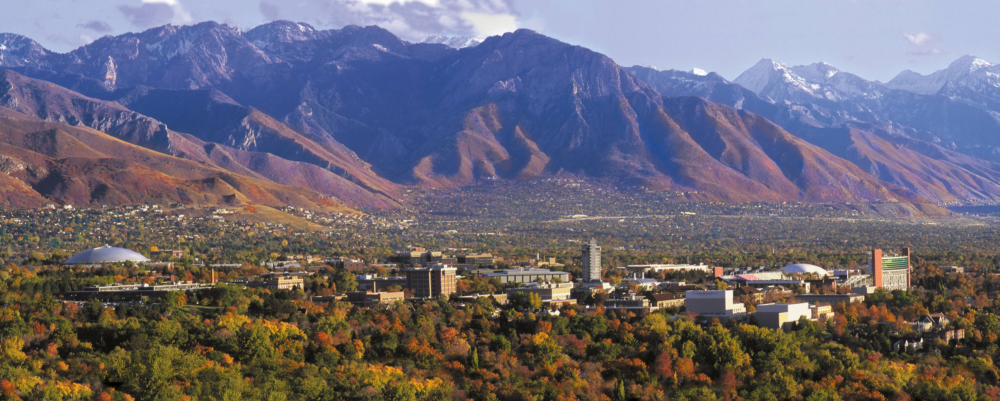

+++
# Project title.
title = "Join us!"

# weight to appear

# Date this page was created.
date = 2019-03-02

# Project summary to display on homepage.
#summary = "A modern C++ task-based parallel programming library."

# Tags: can be used for filtering projects.
# Example: `tags = ["machine-learning", "deep-learning"]`
#tags = ["parallel-programming", "multi-threading", "programming-model", "task-parallelism"]

# Optional external URL for project (replaces project detail page).
#external_link = "https://github.com/cpp-taskflow/cpp-taskflow"

# Featured image
# To use, add an image named `featured.jpg/png` to your project's folder. 
[image]
  # Caption (optional)
  #caption = "Photo by Toa Heftiba on Unsplash"

  # Focal point (optional)
  # Options: Smart, Center, TopLeft, Top, TopRight, Left, Right, BottomLeft, Bottom, BottomRight
  focal_point = "Smart"
+++

## **Open PhD and Postdoc Positions**

We are looking for self-motivated PhD students and postdoc to work on the following research topics:

+ Parallel and Distributed Systems
+ Machine Learning Systems
+ Electronic Design Automation

We expect you to have the following characteristics:

+ Strong motivation
+ C/C++/Python/Linux programming experience
+ Good English communication and writing skills

Experience with *parallel programming*, *distributed systems*, *electronic design automation*,
and *machine learning* is a big plus!
Please also take a look at our [Research Projects](../../#projects) to see our research activities.

## **Why Join us?**

Our group is very supportive for each other. 
We solve *real-world* problems that matter to the society. 
When you start with real problems, you will find plenty of research challenges and topics
worth a PhD thesis. Specifically, you will learn:

+ How to become a *good* programmer
+ How to become an *independent* researcher
+ How to apply ECE/CS knowledge to solve problems

Your graduate life is much more than just research.
In Utah, you can enjoy a variety of outdoor activities such as 
camping, hiking trails, rock hounding, fishing, skiing and more.
Visit [Utah Outdoor Activities](https://www.utahoutdooractivities.com/) for more details.

## **How to Join?**

[Email me](mailto:twh760812@gmail.com) (twh760812 at gmail dot com) your CV if you are interested.
You can also see the hiring poster [here](utah-recruit-poster.pdf).

